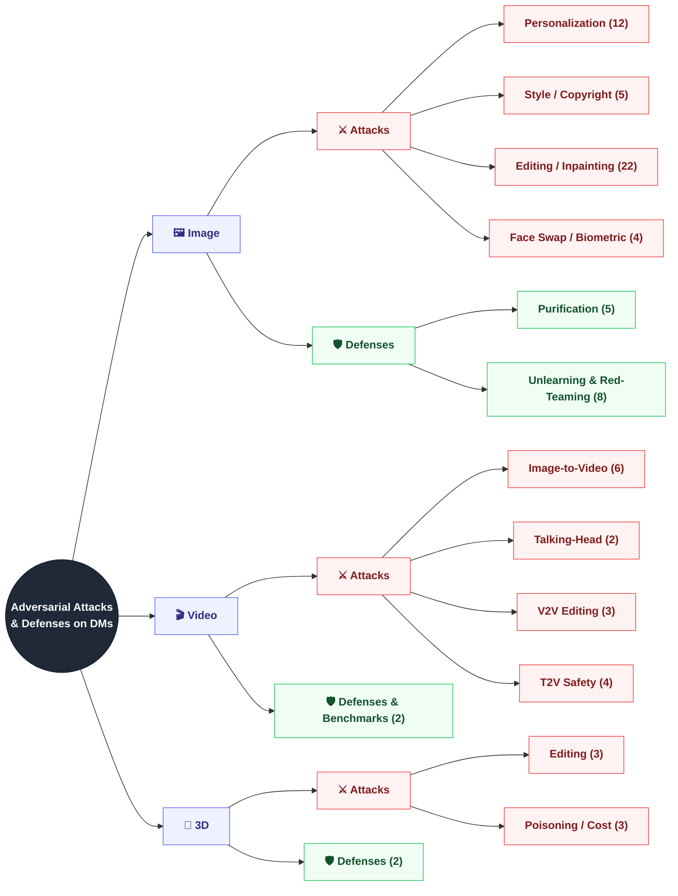

<div align="center">

# 🛡️ Awesome Adversarial Attacks & Defenses on Diffusion Models

### A curated, task-centric collection of adversarial attacks and defenses for diffusion models across **image**, **video**, and **3D**

Ozgur Kara<sup>1</sup> · Tarik Can Ozden<sup>1</sup> · Furkan Horoz<sup>1</sup> · Zeqian Long<sup>1,3</sup> · Haotian Xue<sup>2</sup> · Yipu Chen<sup>2</sup> · Oguzhan Akcin<sup>4</sup> · Yongxin Chen<sup>2</sup> · James Matthew Rehg<sup>1</sup>

<sup>1</sup>University of Illinois Urbana-Champaign · <sup>2</sup>Georgia Institute of Technology · <sup>3</sup>Stanford University · <sup>4</sup>The University of Texas at Austin

[](https://awesome.re)
[](CONTRIBUTING.md)
[](LICENSE)
[](https://github.com/ozgurkara99/awesome-adv-attack-defense-on-diffusion/commits/main)
[](https://github.com/ozgurkara99/awesome-adv-attack-defense-on-diffusion/stargazers)

*81+ methods · 55+ datasets & benchmarks · one unified taxonomy*

</div>

---

Diffusion models are now the dominant generative paradigm for visual content — and their public availability enables misuse at scale: unauthorized personalization, style mimicry, malicious editing, deepfake videos, and instruction-driven 3D manipulation. A fast-growing body of research fights back with **adversarial attacks** (protective "cloaks" that immunize content *before* it can be exploited) and **defenses** (purification, unlearning, moderation, and red-teaming).

This repository accompanies our survey — **the first unified review of this literature across all three visual modalities (image, video, and 3D)** — and organizes every method by the *generative task it targets*, so that works addressing the same threat are directly comparable.

> 🧭 **The three-actor threat model used throughout:** **Alice** (content owner) publishes content *x* · **Bob** (defender) applies an imperceptible cloak *δ* with budget ‖δ‖ ≤ ε before release · **Eve** (adversary) runs a diffusion pipeline on the published content — and, as an *adaptive* adversary controlling the whole pipeline, may also purify the cloak away. "Attacks" are Bob's proactive cloaks against generative pipelines; "defenses" are Eve's counter-measures and platform-side protections.

## 🗞️ News

- **2026-07** · Initial release: 81 methods across image, video, and 3D, with verified paper/code links, per-modality evaluation matrices, and 55+ datasets & benchmarks.

## 📌 Contents

- [Taxonomy](#taxonomy)
- [Threat Model at a Glance](#threat-model-at-a-glance)
- [🖼️ Image](#image)
  - [Attacks](#image-attacks): [Personalization](#personalization) · [Style / Copyright](#style--copyright) · [Editing / Inpainting](#editing--inpainting) · [Face Swap / Biometric](#face-swap--biometric)
  - [Defenses](#image-defenses): [Purification](#purification) · [Unlearning & Red-Teaming](#unlearning--red-teaming)
- [🎬 Video](#video)
  - [Attacks](#video-attacks): [Image-to-Video](#image-to-video-i2v) · [Talking-Head](#talking-head) · [Video-to-Video Editing](#video-to-video-editing) · [Text-to-Video Safety](#text-to-video-safety)
  - [Defenses & Benchmarks](#video-defenses--benchmarks)
- [🧊 3D](#3d)
  - [Attacks](#3d-attacks): [Editing](#editing) · [Poisoning / Cost](#poisoning--cost)
  - [Defenses](#3d-defenses)
- [📊 Evaluation](#evaluation)
  - [Datasets & Benchmarks](#datasets--benchmarks) · [Metrics](#metrics)
- [🔭 Open Challenges](#open-challenges)
- [📚 Related Surveys](#related-surveys)
- [🤝 Contributing](#contributing)
- [📖 Citation](#citation)

---

<a id="taxonomy"></a>
## 🌳 Taxonomy

Methods are organized **by modality → attack/defense → generative task**, and chronologically within each task. This makes methods that target the same misuse directly comparable and exposes each task's attack/counter-attack arms race.



<a id="threat-model-at-a-glance"></a>
## 🎯 Threat Model at a Glance

One framework, three modalities — the cloak's space, budget ε, and entry point φ change fundamentally with the domain, which is why cloaks transfer poorly across backbones:

| Modality | Eve's Pipeline (target task) | Bob's Cloak Space (δ) | Budget (ε) | Entry Point (φ) |
|:---|:---|:---|:---:|:---|
| 🖼️ **Image** | Personalization · Style/copyright · Editing/inpainting · Face-swap | Additive pixel noise (ℓ∞) | {4, 8, 16}/255 | VAE encoder (latent) · identity map (pixel) · patch tokens (DiT) |
| 🎬 **Video** | I2V animation · Talking-head · V2V editing · T2V safety | Additive frame noise (ℓ∞) · optical-flow shift (ℓ2) | {8, 16, 32}/255 | Temporal-attention encoder · spatio-temporal tokens |
| 🧊 **3D** | Instruction-driven editing · Poisoning/compute cost · Reconstruction | Parameter offsets on 3DGS (Δ) · rendered-view cloaks (lifted) | Method-specific | 3D representation parameters · differentiable renderer |

**How to read the method tables.** Each modality section lists methods per task (chronological, mirroring the survey), with a one-line TL;DR and links. A collapsible **evaluation matrix** at the end of each section reports each paper's evaluation sources, target models, and whether it analyzes **IA** (imperceptibility), **FA** (failure modes), **TR** (transferability), and **RB** (robustness to adaptive countermeasures like purification).

---

<a id="image"></a>
# 🖼️ Image

Adversarial research originated in the image domain, catalyzed by the public release of large-scale diffusion models. A single backbone supports many downstream tasks — each one a distinct attack surface.

## Image: Attacks
<a id="image-attacks"></a>

### Personalization

*Personalization methods (DreamBooth & friends) fine-tune a model on a few photos of a subject; misused, they enable identity theft and non-consensual imagery. A cloak here makes fine-tuning on protected images fail.*

| Method | Venue | TL;DR | Links |
|:---|:---:|:---|:---|
| **Anti-DreamBooth** | ICCV 2023 | Optimizes noise that corrupts the DreamBooth fine-tuning loop itself, so personalization on protected photos fails; the baseline anti-personalization cloak. | [📄&nbsp;Paper](https://arxiv.org/abs/2303.15433) · [💻&nbsp;Code](https://github.com/VinAIResearch/Anti-DreamBooth) · [🌐&nbsp;Page](https://vinairesearch.github.io/Anti-DreamBooth/) |
| **SimAC** | CVPR 2024 | Strengthens anti-customization by adaptively attacking the most informative timesteps and network features. | [📄&nbsp;Paper](https://arxiv.org/abs/2312.07865) · [💻&nbsp;Code](https://github.com/somuchtome/SimAC) |
| **InMark** | CVPR 2024 | Embeds protective watermarks on influential pixels (influence-function-inspired selection) so personalized fine-tuning fails even after common image modifications. | [📄&nbsp;Paper](https://openaccess.thecvf.com/content/CVPR2024/html/Liu_Countering_Personalized_Text-to-Image_Generation_with_Influence_Watermarks_CVPR_2024_paper.html) |
| **MetaCloak** | CVPR 2024 | Meta-learns transferable, robust cloaks over a model ensemble; demonstrated against a real commercial service (Replicate). | [📄&nbsp;Paper](https://arxiv.org/abs/2311.13127) · [💻&nbsp;Code](https://github.com/liuyixin-louis/MetaCloak) · [🌐&nbsp;Page](https://metacloak.github.io/) |
| **HF-Anti-DreamBooth** | ECCV 2024 Workshops | Concentrates perturbation power in high-frequency image regions that low-pass purifiers miss. | [📄&nbsp;Paper](https://arxiv.org/abs/2409.08167) · [💻&nbsp;Code](https://github.com/mti-lab/HF-ADB) |
| **DisDiff** | ACM MM 2024 | Erases subject-token cross-attention to break the text–subject binding during customization. | [📄&nbsp;Paper](https://arxiv.org/abs/2405.20584) |
| **FastProtect** | CVPR 2025 | Replaces per-image optimization with a pre-trained perturbation generator, protecting images 200–3,500× faster at nearly zero cost. | [📄&nbsp;Paper](https://arxiv.org/abs/2412.11423) · [🌐&nbsp;Page](https://webtoon.github.io/impasto/) |
| **AntiPure** | ICCV 2025 | Constructs protective perturbations that persist through diffusion-based purification. | [📄&nbsp;Paper](https://arxiv.org/abs/2509.13922) |
| **LDU** | ACM MM 2025 | Protects against unauthorized personalization by shifting the denoising trajectory of the diffusion model. | [📄&nbsp;Paper](https://arxiv.org/abs/2510.03089) · [💻&nbsp;Code](https://github.com/naresh-ub/unlearnable_samples) |
| **DADiff** | arXiv 2025 | Combines prompt-level and image-level adversarial attacks to disrupt customization more thoroughly. | [📄&nbsp;Paper](https://arxiv.org/abs/2503.13945) |
| **IDDM** | arXiv 2026 | Protects personalized generation while disrupting face recognition of the generated images, with a tunable privacy–utility trade-off. | [📄&nbsp;Paper](https://arxiv.org/abs/2604.00903) |
| **VCPro** | AAAI 2026 | Confines the least-perceptible cloak to user-masked key concepts via selective adversarial perturbations. | [📄&nbsp;Paper](https://arxiv.org/abs/2408.08518) · [💻&nbsp;Code](https://github.com/KululuMi/VCPro) |

### Style / Copyright

*Style mimicry fine-tunes a model on an artist's works to reproduce their signature style on demand. A style cloak makes the model learn the wrong style from protected artworks.*

| Method | Venue | TL;DR | Links |
|:---|:---:|:---|:---|
| **Glaze** | USENIX Security 2023 | Style cloaks that make models fine-tuned on protected artworks learn the wrong artistic style; a deployed end-user tool protecting over 2M images, and the first to flag purification as a threat. | [📄&nbsp;Paper](https://arxiv.org/abs/2302.04222) · [🌐&nbsp;Page](https://glaze.cs.uchicago.edu) |
| **Mist** | arXiv 2023 | Improves the transferability of anti-mimicry cloaks with a fused adversarial loss term. | [📄&nbsp;Paper](https://arxiv.org/abs/2305.12683) · [💻&nbsp;Code](https://github.com/psyker-team/mist) · [🌐&nbsp;Page](https://psyker-team.github.io/index_en.html) |
| **ID-Cloak** | arXiv 2025 | Models an identity subspace to craft identity-specific universal cloaks that transfer across images of the same person. | [📄&nbsp;Paper](https://arxiv.org/abs/2502.08097) |
| **SITA** | IEEE TIFS 2025 | Uses CLIP to decouple and disrupt the style representation when the downstream fine-tuning method is unknown. | [📄&nbsp;Paper](https://arxiv.org/abs/2503.19791) · [💻&nbsp;Code](https://github.com/A-raniy-day/SITA) |
| **StyleProtect** | CVPR 2026 Workshops | Safeguards artistic identity in fine-tuned diffusion models by targeting selected cross-attention layers. | [📄&nbsp;Paper](https://arxiv.org/abs/2509.13711) |

### Editing / Inpainting

*Text-guided editing alters a real photo from an instruction; inpainting fills a masked region. Both enable unauthorized manipulation of published photos — the cloak's goal is to derail the edit and leave the output unusable.*

| Method | Venue | TL;DR | Links |
|:---|:---:|:---|:---|
| **PhotoGuard** | ICML 2023 | The de-facto editing-protection baseline: a cheap VAE-encoder attack plus a stronger end-to-end diffusion attack that steers generation toward a target image. | [📄&nbsp;Paper](https://arxiv.org/abs/2302.06588) · [💻&nbsp;Code](https://github.com/madrylab/photoguard) · [🌐&nbsp;Page](https://gradientscience.org/photoguard/) |
| **AdvDM** | ICML 2023 | Formulates protection as minimizing the diffusion likelihood of a perturbed image, optimized by maximizing the expected diffusion loss over sampled latent trajectories. | [📄&nbsp;Paper](https://arxiv.org/abs/2302.04578) |
| **SDS** | ICLR 2024 | Accelerates diffusion-loss protection attacks via score distillation sampling. | [📄&nbsp;Paper](https://arxiv.org/abs/2311.12832) · [💻&nbsp;Code](https://github.com/xavihart/Diff-Protect) |
| **EditShield** | ECCV 2024 | Protects against instruction-guided editors (InstructPix2Pix) by shifting the instruction-independent conditioning latent. | [📄&nbsp;Paper](https://arxiv.org/abs/2311.12066) · [💻&nbsp;Code](https://github.com/Allen-piexl/Editshield) |
| **Anti-Reference** | arXiv 2024 | A unified weighted loss jointly targets tuning-based customization and reference-conditioned generation modules. | [📄&nbsp;Paper](https://arxiv.org/abs/2412.05980) · [💻&nbsp;Code](https://github.com/songyiren725/AntiReference) |
| **Anti-Diffusion** | AAAI 2025 | Adds a semantic disturbance loss that drives cross-attention maps toward a zero target; introduces the Defense-Edit benchmark. | [📄&nbsp;Paper](https://arxiv.org/abs/2503.05595) · [💻&nbsp;Code](https://github.com/whulizheng/Anti-Diffusion) |
| **AtkPDM** | AAAI 2025 | Attacks intermediate U-Net features of pixel-domain diffusion models, where latent-space cloaks do not transfer. | [📄&nbsp;Paper](https://arxiv.org/abs/2408.11810) · [💻&nbsp;Code](https://github.com/AlexPeng517/AtkPDM) · [🌐&nbsp;Page](https://alexpeng517.github.io/AtkPDM/) |
| **TarPro** | AAAI 2026 | Targeted protection with a semantic-aware constraint that suppresses malicious prompt components while preserving benign edits. | [📄&nbsp;Paper](https://arxiv.org/abs/2503.13994) |
| **ACE** | ICLR 2025 | Makes the protection attack targeted, steering the predicted score toward one fixed chaotic pattern. | [📄&nbsp;Paper](https://arxiv.org/abs/2310.04687) · [💻&nbsp;Code](https://github.com/caradryanl/ACE) |
| **AdvPaint** | ICLR 2025 | Disrupts self- and cross-attention with separate perturbations inside and outside an enlarged object box, tailored to inpainting. | [📄&nbsp;Paper](https://arxiv.org/abs/2503.10081) · [💻&nbsp;Code](https://github.com/JoonsungJeon/AdvPaint) · [🌐&nbsp;Page](https://sgvr.kaist.ac.kr/~joonsung/AdvPaint/) |
| **DiffusionGuard** | ICLR 2025 | Disrupts the early stages of the diffusion process and hardens the cloak via mask augmentation; introduces InpaintGuardBench. | [📄&nbsp;Paper](https://arxiv.org/abs/2410.05694) · [💻&nbsp;Code](https://github.com/choi403/DiffusionGuard) |
| **FaceLock** | CVPR 2025 | Erases the subject's biometric information so maliciously edited faces no longer match the person. | [📄&nbsp;Paper](https://arxiv.org/abs/2411.16832) · [💻&nbsp;Code](https://github.com/taco-group/FaceLock) · [🌐&nbsp;Page](https://hhwang.netlify.app/publication/facelock/) |
| **AdvI2I** | ICML 2025 | Trains a generator whose adversarial images drive image-to-image models toward unsafe outputs under benign prompts. | [📄&nbsp;Paper](https://arxiv.org/abs/2410.21471) · [💻&nbsp;Code](https://github.com/Spinozaaa/AdvI2I) |
| **DCT-Shield** | ICCV 2025 | Optimizes perturbations over quantized DCT coefficients of a JPEG encode–decode pipeline, yielding compression-robust cloaks. | [📄&nbsp;Paper](https://arxiv.org/abs/2504.17894) · [🌐&nbsp;Page](https://dct-shield.github.io/project-page/) |
| **PromptFlare** | ACM MM 2025 | A cross-attention decoy that drives masked-region attention toward the prompt-invariant BOS token, generalizing across prompts. | [📄&nbsp;Paper](https://arxiv.org/abs/2508.16217) · [💻&nbsp;Code](https://github.com/NAHOHYUN-SKKU/PromptFlare) |
| **BlurGuard** | NeurIPS 2025 | Adaptively blurs the cloak per semantic region so the protected image better preserves the original power spectrum, improving robustness to purification. | [📄&nbsp;Paper](https://arxiv.org/abs/2511.00143) · [💻&nbsp;Code](https://github.com/jsu-kim/BlurGuard) |
| **PCA** | IEEE TIFS 2025 | Gray-box attack that collapses the VAE posterior via KL manipulation, requiring no knowledge of the downstream editor. | [📄&nbsp;Paper](https://arxiv.org/abs/2408.10901) · [💻&nbsp;Code](https://github.com/ZhongliangGuo/PosteriorCollapseAttack) |
| **DeContext** | arXiv 2025 | Disrupts the in-context cross-attention flow of DiT-based editors such as FLUX.1 Kontext. | [📄&nbsp;Paper](https://arxiv.org/abs/2512.16625) · [💻&nbsp;Code](https://github.com/LinghuiiShen/DeContext) · [🌐&nbsp;Page](https://linghuiishen.github.io/decontext_project_page/) |
| **SDA** | arXiv 2025 | Perturbs first-step self-attention queries to break early contour formation in inpainting pipelines. | [📄&nbsp;Paper](https://arxiv.org/abs/2505.19425) |
| **Anti-Inpainting** | IEEE TDSC 2026 | Extends inpainting protection to unknown masks, prompts, and seeds via a proactive multi-level defense. | [📄&nbsp;Paper](https://arxiv.org/abs/2505.13023) |
| **DiffVax** | ICLR 2026 | Optimization-free immunization: a trained feed-forward immunizer cloaks unseen images in one pass (~250,000× faster) and extends to video. | [📄&nbsp;Paper](https://arxiv.org/abs/2411.17957) · [💻&nbsp;Code](https://github.com/ozdentarikcan/DiffVax) · [🌐&nbsp;Page](https://diffvax.github.io/) |
| **Universal Immunization** | ECCV 2026 | Amortizes protection into a single image-agnostic universal perturbation via semantic injection. | [📄&nbsp;Paper](https://arxiv.org/abs/2602.14679) |

### Face Swap / Biometric

*Face swapping transplants a target identity onto another face — the core deepfake mechanism. Cloaks make swappers extract the wrong identity.*

| Method | Venue | TL;DR | Links |
|:---|:---:|:---|:---|
| **FaceShield** | ICCV 2025 | Disrupts diffusion face-swappers via attention attacks on source conditioning and facial-feature-extractor attacks, with blur/low-pass updates for imperceptibility and JPEG robustness. | [📄&nbsp;Paper](https://arxiv.org/abs/2412.09921) · [💻&nbsp;Code](https://github.com/kuai-lab/iccv25_faceshield) |
| **FaceSwapGuard** | arXiv 2025 | Imperceptible perturbations that disrupt identity-feature extraction in black-box face-swapping models. | [📄&nbsp;Paper](https://arxiv.org/abs/2502.10801) |
| **My Face Is Mine** | arXiv 2025 | Identity and timestep-averaged deviation losses craft memory-efficient LDM-latent perturbations that transfer across diffusion-based face swappers. | [📄&nbsp;Paper](https://arxiv.org/abs/2505.15336) |
| **AEGIS** | arXiv 2026 | Injects adversarial signals into the DDIM denoising trajectory, avoiding pixel-space peak clipping and disrupting both GAN- and diffusion-based facial manipulation. | [📄&nbsp;Paper](https://arxiv.org/abs/2604.01635) |

## Image: Defenses
<a id="image-defenses"></a>

*"Defense" spans two arenas: (1) **purification** — the adversary's counters that strip a cloak so the pipeline runs as intended; (2) **unlearning & red-teaming** — a cooperating provider removes or blocks the exploitable capability in the model itself, and red-teamers probe how durable that removal is.*

### Purification

| Method | Venue | TL;DR | Links |
|:---|:---:|:---|:---|
| **JPEG Compression** | arXiv 2023 | Shows that simple JPEG compression substantially weakens PhotoGuard-style protective perturbations. | [📄&nbsp;Paper](https://arxiv.org/abs/2304.02234) |
| **DiffPure** | ICML 2022 | The canonical diffusion-purification formulation: noise-and-denoise smooths out adversarial perturbations while preserving semantics. | [📄&nbsp;Paper](https://arxiv.org/abs/2205.07460) · [💻&nbsp;Code](https://github.com/NVlabs/DiffPure) · [🌐&nbsp;Page](https://diffpure.github.io/) |
| **GrIDPure** | CVPR 2024 | Adapts DiffPure to high-resolution images via small-step purification on overlapping grids with patch averaging. | [📄&nbsp;Paper](https://arxiv.org/abs/2312.00084) · [💻&nbsp;Code](https://github.com/ZhengyueZhao/GrIDPure) |
| **PDM-Pure** | arXiv 2024 | Shows perturbations crafted against LDMs transfer poorly to pixel-space diffusion models, and turns strong PDMs into universal purifiers. | [📄&nbsp;Paper](https://arxiv.org/abs/2404.13320) · [💻&nbsp;Code](https://github.com/xavihart/PDM-Pure) |
| **Noisy Upscaling** | ICLR 2025 | Black-box bypass of Glaze, Mist, and Anti-DreamBooth: inject noise, then reconstruct with a generative upscaler. | [📄&nbsp;Paper](https://arxiv.org/abs/2406.12027) · [💻&nbsp;Code](https://github.com/ethz-spylab/robust-style-mimicry) |

### Unlearning & Red-Teaming

| Method | Venue | TL;DR | Links |
|:---|:---:|:---|:---|
| **SLD** | CVPR 2023 | Adds a safety term to classifier-free guidance that steers denoising away from a text-defined unsafe direction, without retraining. | [📄&nbsp;Paper](https://arxiv.org/abs/2211.05105) · [💻&nbsp;Code](https://github.com/ml-research/safe-latent-diffusion) |
| **AdvUnlearn** | NeurIPS 2024 | Hardens concept erasure by adversarially training the CLIP text encoder with utility-preserving regularization; transfers modularly across diffusion backbones. | [📄&nbsp;Paper](https://arxiv.org/abs/2405.15234) · [💻&nbsp;Code](https://github.com/OPTML-Group/AdvUnlearn) |
| **GuardT2I** | NeurIPS 2024 | Translates guidance embeddings back into natural language to expose intent hidden by adversarial prompts. | [📄&nbsp;Paper](https://arxiv.org/abs/2403.01446) · [💻&nbsp;Code](https://github.com/cure-lab/GuardT2I) |
| **EraseDiff** | arXiv 2024 | Fast unlearning that redirects forget-set denoising toward mismatched targets, erasing data influence from the weights. | [📄&nbsp;Paper](https://arxiv.org/abs/2401.05779) · [💻&nbsp;Code](https://github.com/JingWu321/EraseDiff) |
| **Erasing (Few-shot Unlearning)** | arXiv 2024 | Erases concepts by fine-tuning only the CLIP text encoder on a few images in seconds, though broad concepts resist. | [📄&nbsp;Paper](https://arxiv.org/abs/2405.07288) · [💻&nbsp;Code](https://github.com/fmp453/few-shot-erasing) |
| **CAT** | ICML 2025 | Red-teams protections with lightweight LoRA adapters in the LDM autoencoder that realign latent representations distorted by protected samples — no pixel purification needed. | [📄&nbsp;Paper](https://arxiv.org/abs/2502.07225) · [💻&nbsp;Code](https://github.com/senp98/CAT) |
| **GuardDoor** | arXiv 2025 | Bakes a trigger-activated protective backdoor into the image encoder that survives JPEG, DiffPure, and IMPRESS — sidestepping the purification arms race for cooperating platforms. | [📄&nbsp;Paper](https://arxiv.org/abs/2503.03944) |
| **DiffShortcut** | KDD 2026 | Red-teams protective perturbations by purifying with restoration and super-resolution, then disentangling the personalized concept via contrastive decoupling learning. | [📄&nbsp;Paper](https://arxiv.org/abs/2406.18944) · [💻&nbsp;Code](https://github.com/liuyixin-louis/DiffShortcut) |

<details>
<summary><b>🖼️ Image evaluation matrix</b> — evaluation sources, target models, and analysis coverage (mirrors the survey tables)</summary>

| Method | Evaluation Sources | Target Models | IA | FA | TR | RB |
|:---|:---|:---|:---:|:---:|:---:|:---:|
| **Anti-DreamBooth** | CelebA-HQ, VGGFace2 | DreamBooth, Textual Inversion, DreamBooth w/ LoRA | ✅ | ❌ | ✅ | ✅ |
| **SimAC** | CelebA-HQ, VGGFace2 | DreamBooth, LoRA, Custom Diffusion | ✅ | ❌ | ✅ | ❌ |
| **InMark** | VGGFace2, WikiArt | DreamBooth, Textual Inversion, LoRA | ✅ | ❌ | ✅ | ✅ |
| **MetaCloak** | CelebA-HQ, VGGFace2 | DreamBooth, Replicate | ❌ | ❌ | ✅ | ✅ |
| **HF-Anti-DreamBooth** | VGGFace2 | DreamBooth | ❌ | ❌ | ❌ | ✅ |
| **DisDiff** | CelebA-HQ, VGGFace2 | DreamBooth, LoRA, Textual Inversion | ❌ | ❌ | ✅ | ❌ |
| **FastProtect** | ImageNet, FFHQ, WikiArt, WebToon | LoRA, SD2.1, SDXL, Textual Inversion, DreamStyler | ✅ | ✅ | ✅ | ✅ |
| **AntiPure** | CelebA-HQ, VGGFace2 | DreamBooth, LoRA | ✅ | ❌ | ❌ | ✅ |
| **LDU** | CelebA-HQ, VGGFace2, WikiArt | DreamBooth, Textual Inversion, SD1.5, SD2.1 | ✅ | ❌ | ✅ | ✅ |
| **DADiff** | CelebA-HQ, VGGFace2 | DreamBooth | ❌ | ❌ | ✅ | ❌ |
| **IDDM** | CelebA-HQ, VGGFace2 | DreamBooth, LoRA | ✅ | ❌ | ✅ | ✅ |
| **VCPro** | CelebA-HQ, VGGFace2 | SD1.4 | ✅ | ✅ | ✅ | ✅ |
| **Glaze** | Artworks from current artists, WikiArt | Stable Diffusion, DALL·E-mega | ✅ | ✅ | ✅ | ✅ |
| **Mist** | WikiArt | Stable Diffusion, NovelAI | ✅ | ❌ | ✅ | ✅ |
| **ID-Cloak** | CelebA-HQ, VGGFace2 | SD1.5, SD2.1, DreamBooth, DreamBooth-LoRA, Textual Inversion | ❌ | ❌ | ✅ | ❌ |
| **SITA** | WikiArt, ArtBench | T2I-Adapter, Textual Inversion, DreamBooth | ✅ | ✅ | ✅ | ✅ |
| **StyleProtect** | WikiArt, Anita | SD1.5 | ✅ | ❌ | ❌ | ✅ |
| **PhotoGuard** | 60 curated images | SD1.5 | ❌ | ✅ | ❌ | ❌ |
| **AdvDM** | LSUN, WikiArt | LDM | ✅ | ❌ | ✅ | ✅ |
| **SDS** | Crawled landscape/anime/portrait pictures, WikiArt | SD LDM | ✅ | ✅ | ✅ | ✅ |
| **EditShield** | InstructPix2Pix, MagicBrush | InstructPix2Pix, ip2p-mb | ❌ | ✅ | ✅ | ✅ |
| **Anti-Reference** | DreamBooth, CelebA-HQ, TikTok | DreamBooth, LoRA, Textual Inversion, IP-Adapter, Reference-only, MagicAnimate, EchoMimic | ✅ | ✅ | ✅ | ✅ |
| **Anti-Diffusion** | VGGFace2, CelebA-HQ, Defense-Edit | DreamBooth, LoRA, MasaCtrl, DiffEdit, SD2.1 | ✅ | ❌ | ✅ | ❌ |
| **AtkPDM** | 30 images per PDM (half training data, half web-crawled) | Unconditional pixel-domain DDPMs | ✅ | ❌ | ✅ | ✅ |
| **TarPro** | Synthetic individuals from Midjourney's gallery | InstructPix2Pix, MagicBrush, HQ-Edit | ✅ | ❌ | ❌ | ❌ |
| **ACE** | CelebA-HQ, WikiArt | LoRA+DreamBooth, SDEdit | ✅ | ✅ | ✅ | ✅ |
| **AdvPaint** | 100 images from Pexels & Unsplash | SD Inpainting | ✅ | ✅ | ✅ | ✅ |
| **DiffusionGuard** | InpaintGuardBench | SD Inpainting | ✅ | ❌ | ✅ | ✅ |
| **FaceLock** | CelebA-HQ | InstructPix2Pix | ✅ | ❌ | ❌ | ✅ |
| **AdvI2I** | 2k NSFW pairs | InstructPix2Pix, SD1.5 | ✅ | ✅ | ✅ | ✅ |
| **DCT-Shield** | OmniEdit, PPR10K | InstructPix2Pix, SD1.0 | ✅ | ✅ | ✅ | ✅ |
| **PromptFlare** | EditBench | SD Inpainting | ✅ | ✅ | ✅ | ✅ |
| **BlurGuard** | ImageNet-Edit, MagicBrush, InpaintGuardBench, Helen, WikiArt, VGGFace2 | SD1.4 | ✅ | ✅ | ✅ | ✅ |
| **PCA** | ImageNet, LAION | SD1.4, SD1.5 | ✅ | ❌ | ✅ | ✅ |
| **DeContext** | VGGFace2, CelebA-HQ | FLUX.1-Kontext-dev | ❌ | ✅ | ❌ | ❌ |
| **SDA** | 100 face/mask pairs + COCO | SD2 | ❌ | ✅ | ✅ | ✅ |
| **Anti-Inpainting** | InpaintGuardBench, CelebA-HQ | SD1.5 | ❌ | ❌ | ✅ | ✅ |
| **DiffVax** | CCP dataset | SD Inpainting, InstructPix2Pix, MagicBrush | ✅ | ✅ | ✅ | ✅ |
| **Universal Immunization** | Synthetic dataset, ImageNet-Edit | SD1.4, SD1.5, SD2.0, InstructPix2Pix | ✅ | ✅ | ✅ | ✅ |
| **FaceShield** | CelebA-HQ, VGGFace2-HQ | DiffFace, DiffSwap, FaceSwap, IP-Adapter | ✅ | ✅ | ✅ | ✅ |
| **FaceSwapGuard** | CelebA-HQ | FaceShifter, SimSwap | ✅ | ✅ | ✅ | ✅ |
| **My Face Is Mine** | CelebA-HQ | FaceAdapter | ✅ | ✅ | ✅ | ✅ |
| **AEGIS** | CelebA, FFHQ, LFW | StarGAN, AttGAN, HiSD | ✅ | ✅ | ✅ | ✅ |
| **JPEG Compression** | Protected images | PhotoGuard | ✅ | ❌ | ➖ | ❌ |
| **DiffPure** | CIFAR-10, CelebA-HQ, ImageNet | Classification models | ✅ | ❌ | ➖ | ❌ |
| **GrIDPure** | CelebA-HQ, WikiArt | AdvDM, Anti-DreamBooth, Glaze | ✅ | ✅ | ➖ | ❌ |
| **PDM-Pure** | ImageNet, SDS | AdvDM, SDS, PhotoGuard, Mist | ✅ | ❌ | ➖ | ❌ |
| **Noisy Upscaling** | WikiArt, artworks from artists | Anti-DreamBooth, Glaze, Mist | ✅ | ✅ | ➖ | ❌ |
| **SLD** | Inappropriate Image Prompts (I2P) | SD1.4 | ➖ | ✅ | ✅ | ❌ |
| **AdvUnlearn** | I2P, Imagenette, COCO | SD1.4 | ➖ | ✅ | ✅ | ✅ |
| **GuardT2I** | I2P, I2P-Sexual, SneakyPrompt, MMA-Diffusion, Ring-A-Bell, P4D | SD1.5 | ➖ | ✅ | ✅ | ✅ |
| **EraseDiff** | CIFAR-10, UTKFace, CelebA, CelebA-HQ | Conditional DDIM, unconditional DDIM/DDPM | ➖ | ✅ | ➖ | ✅ |
| **Erasing (Few-shot Unlearning)** | Author-chosen concepts with CLIP ImageNet templates | SD1.5 | ➖ | ✅ | ➖ | ❌ |
| **CAT** | CelebA-HQ, VGGFace2, WikiArt | AdvDM, Mist, SDS, Glaze, Anti-DreamBooth, MetaCloak | ➖ | ❌ | ➖ | ❌ |
| **GuardDoor** | CelebA, WikiArt | SD2.1 | ✅ | ❌ | ➖ | ✅ |
| **DiffShortcut** | VGGFace2 | MetaCloak, AdvDM, PhotoGuard, Glaze | ➖ | ❌ | ➖ | ❌ |

*IA = Imperceptibility Analysis · FA = Failure Analysis · TR = Transferability · RB = Robustness to countermeasures · ✅ reported · ❌ not reported · ➖ not applicable*

</details>

---

<a id="video"></a>
# 🎬 Video

Video is the fastest-growing attack surface, contending with the **temporal axis** (per-frame cloaks dilute; cross-frame attention mixes features) and **aggressively lossy codecs** that strip non-robust perturbations.

## Video: Attacks
<a id="video-attacks"></a>

### Image-to-Video (I2V)

*I2V pipelines animate a reference image, risking misleading content built from a single photo.*

| Method | Venue | TL;DR | Links |
|:---|:---:|:---|:---|
| **UVCG** | arXiv 2024 | Makes one perturbation universal across videos by leveraging temporal consistency. | [📄&nbsp;Paper](https://arxiv.org/abs/2411.17746) |
| **I2VGuard** | CVPR 2025 | The first white-box I2V defense, composing spatial, temporal, and contrastive-latent losses. | [📄&nbsp;Paper](https://openaccess.thecvf.com/content/CVPR2025/html/Gui_I2VGuard_Safeguarding_Images_against_Misuse_in_Diffusion-based_Image-to-Video_Models_CVPR_2025_paper.html) |
| **DORMANT** | USENIX Security 2025 | Protects against pose-driven human-image animation by misextracting CLIP and ReferenceNet features, with EoT and momentum. | [📄&nbsp;Paper](https://arxiv.org/abs/2409.14424) · [💻&nbsp;Code](https://github.com/Manu21JC/Dormant) |
| **Vid-Freeze** | arXiv 2025 | Freezes motion to the first frame — the generated video looks plausible but stays static. | [📄&nbsp;Paper](https://arxiv.org/abs/2509.23279) |
| **Anti-I2V** | CVPR 2026 | Handles DiT-based I2V via CIELAB color-space and frequency-domain collapse losses, since U-Net cloaks fail on DiTs. | [📄&nbsp;Paper](https://arxiv.org/abs/2603.24570) |
| **Immune2V** | arXiv 2026 | Explains why image cloaks fail on dual-stream I2V (per-frame noise dilutes, text guidance overrides) and counters with a temporally balanced latent-divergence loss plus alignment to a collapse-inducing trajectory. | [📄&nbsp;Paper](https://arxiv.org/abs/2604.10837) · [💻&nbsp;Code](https://github.com/Zeqian-Long/Immune2V) |

### Talking-Head

*Audio-driven talking-head generation animates a portrait to say anything — cloaks nullify the audio control or break lip-sync.*

| Method | Venue | TL;DR | Links |
|:---|:---:|:---|:---|
| **Silencer** | CVPR 2025 | Nullifies audio control so the mouth stays closed, then aligns DDIM latents for anti-purification. | [📄&nbsp;Paper](https://arxiv.org/abs/2506.01591) · [💻&nbsp;Code](https://github.com/yuangan/Silencer) |
| **SyncBreaker** | arXiv 2026 | Stage-aware multimodal attack on both the image and audio streams of audio-driven talking-head generation. | [📄&nbsp;Paper](https://arxiv.org/abs/2604.08405) |

### Video-to-Video Editing

*V2V editing restyles or manipulates existing footage; lossy video compression is the central obstacle for perturbation persistence.*

| Method | Venue | TL;DR | Links |
|:---|:---:|:---|:---|
| **PRIME** | arXiv 2024 | Per-frame PhotoGuard with in-loop codec simulation, at ~90% lower cost; identifies lossy video compression as the central obstacle. | [📄&nbsp;Paper](https://arxiv.org/abs/2402.01239) · [💻&nbsp;Code](https://github.com/GuanlinLee/prime) |
| **VGMShield** | arXiv 2024/25 | Broadens the scope to lifecycle defense: detection, attribution, and prevention of video-generation misuse. | [📄&nbsp;Paper](https://arxiv.org/abs/2402.13126) · [💻&nbsp;Code](https://github.com/py85252876/MMVGM) |
| **VideoGuard** | arXiv 2025 | Tackles codec non-differentiability directly: optimizes a DDIM latent before gradient-free PSO on pixels. | [📄&nbsp;Paper](https://arxiv.org/abs/2508.03480) |

### Text-to-Video Safety

*Prompt-level attacks jailbreak T2V models into unsafe generations; defenses rewrite prompts and detect unsafe outputs.*

| Method | Venue | TL;DR | Links |
|:---|:---:|:---|:---|
| **T2VAttack** | arXiv 2025 | Perturbs prompts to induce semantic and temporal failures in T2V diffusion models; introduces T2VAttackBench. | [📄&nbsp;Paper](https://arxiv.org/abs/2512.23953) |
| **T2V-OptJail** | NeurIPS 2025 | Discrete prompt optimization jailbreaks commercial T2V services with ~64% success. | [📄&nbsp;Paper](https://arxiv.org/abs/2505.06679) |
| **ConceptGuard** | arXiv 2025 | Proactive multimodal risk detection for text-and-image-to-video generation; introduces the ConceptRisk dataset. | [📄&nbsp;Paper](https://arxiv.org/abs/2511.18780) · [💻&nbsp;Code](https://github.com/Ruize-Ma/ConceptGuard) |
| **T2VShield** | IJCV 2026 | Model-agnostic jailbreak defense: rewrites prompts and detects unsafe output (~33% attack-success-rate drop). | [📄&nbsp;Paper](https://arxiv.org/abs/2504.15512) |

## Video: Defenses & Benchmarks
<a id="video-defenses--benchmarks"></a>

*Counter-defenses against video cloaks are still nascent: existing work treats preprocessing and purification as robustness stress tests rather than dedicated removal methods — in contrast to the image domain's purification arms race. Video-domain purification remains largely unexplored.*

| Method | Venue | TL;DR | Links |
|:---|:---:|:---|:---|
| **T2VSafetyBench** | NeurIPS 2024 | The standard T2V safety benchmark: 4,400 malicious prompts across 12 safety categories, including video-specific temporal risk. | [📄&nbsp;Paper](https://arxiv.org/abs/2407.05965) · [💻&nbsp;Code](https://github.com/yibo-miao/T2VSafetyBench) |
| **IPV-Bench** | arXiv 2026 | Benchmarks I2V image-protection methods under diverse image-to-video generation scenarios, showing existing protections remain fragile to practical transformations. | [📄&nbsp;Paper](https://arxiv.org/abs/2603.26154) |

<details>
<summary><b>🎬 Video evaluation matrix</b> — evaluation sources, target models, and analysis coverage (mirrors the survey tables)</summary>

| Method | Evaluation Sources | Target Models | IA | FA | TR | RB |
|:---|:---|:---|:---:|:---:|:---:|:---:|
| **UVCG** | DAVIS subset | SVD, TokenFlow, Text2Video-Zero | ✅ | ❌ | ✅ | ❌ |
| **I2VGuard** | Manually curated set | SVD, CogVideoX, ControlNeXt | ✅ | ❌ | ❌ | ❌ |
| **DORMANT** | TikTok, Champ, UBC Fashion, TED Talks | Animate Anyone, MagicAnimate, MagicPose, MusePose, Champ, MuseV, UniAnimate, ControlNeXt | ✅ | ✅ | ✅ | ✅ |
| **Vid-Freeze** | Manually curated set | SVD, CogVideoX | ✅ | ❌ | ❌ | ✅ |
| **Anti-I2V** | CelebV-Text, UCF101 | CogVideoX, OpenSora, DynamiCrafter | ✅ | ❌ | ✅ | ✅ |
| **Immune2V** | DAVIS subset | Wan, DynamiCrafter, I2VGen-XL | ✅ | ✅ | ✅ | ✅ |
| **Silencer** | CelebA-HQ, TalkingHead-1KH | Hallo | ✅ | ❌ | ✅ | ✅ |
| **SyncBreaker** | CelebA-HQ + LibriSpeech, HDTF | Hallo | ✅ | ❌ | ❌ | ✅ |
| **PRIME** | VIOLENT | TokenFlow, Rerender-A-Video | ✅ | ❌ | ✅ | ✅ |
| **VGMShield** | WebVid-10M, InternVid | Hotshot-XL, I2VGen-XL, LaVie, SEINE, Show-1, SVD, VideoCrafter | ✅ | ✅ | ✅ | ❌ |
| **VideoGuard** | DAVIS subset | Tune-A-Video, Fate-Zero, Video-P2P | ✅ | ✅ | ❌ | ❌ |
| **T2VAttack** | T2VAttackBench | ModelScope, CogVideoX, Open-Sora, HunyuanVideo | ✅ | ✅ | ❌ | ❌ |
| **T2V-OptJail** | T2VSafetyBench | Open-Sora, Pika, Luma, Kling | ✅ | ❌ | ✅ | ✅ |
| **ConceptGuard** | ConceptRisk, T2VSafetyBench-TI2V | CogVideoX | ➖ | ✅ | ✅ | ✅ |
| **T2VShield** | T2VSafetyBench, SafeWatch, MSVD | Open-Sora, CogVideoX, Kling, Luma, Pika | ➖ | ❌ | ✅ | ✅ |
| **T2VSafetyBench** | 4,400 prompts, 12 categories | T2V generative models | ➖ | ➖ | ➖ | ➖ |
| **IPV-Bench** | Preprocessing & transfer settings | I2V protection methods | ➖ | ➖ | ➖ | ➖ |

*IA = Imperceptibility Analysis · FA = Failure Analysis · TR = Transferability · RB = Robustness to countermeasures · ✅ reported · ❌ not reported · ➖ not applicable*

</details>

---

<a id="3d"></a>
# 🧊 3D

3D representations are not diffusion models themselves, but they have become an emerging security surface: modern 3D assets are edited through **rendered views and diffusion-based guidance**, so perturbations must survive multi-view rendering without being smoothed away.

## 3D: Attacks
<a id="3d-attacks"></a>

### Editing

| Method | Venue | TL;DR | Links |
|:---|:---:|:---|:---|
| **Image2Multiview** | ICME 2025 | Protects 3D assets by perturbing the source image to disrupt multi-view diffusion and downstream reconstruction. | [📄&nbsp;Paper](https://arxiv.org/abs/2408.11408) · [💻&nbsp;Code](https://github.com/super-jw/LFADEA) |
| **DEGauss** | NeurIPS 2025 | Optimizes perturbations over Gaussian representations with view-focal gradient fusion and dual-discrepancy objectives to defend 3DGS assets from malicious editing. | [📄&nbsp;Paper](https://openreview.net/forum?id=Lm4VIXVIuy) |
| **AdLift** | ICML 2026 | Lifts bounded rendered-view perturbations into safeguard Gaussians so protection stays consistent under novel-view interpolation instead of being smoothed away. | [📄&nbsp;Paper](https://arxiv.org/abs/2512.07247) |

### Poisoning / Cost

| Method | Venue | TL;DR | Links |
|:---|:---:|:---|:---|
| **Poison-splat** | ICLR 2025 | A system-level attack on the computational cost of 3DGS reconstruction. | [📄&nbsp;Paper](https://arxiv.org/abs/2410.08190) · [💻&nbsp;Code](https://github.com/jiahaolu97/poison-splat) |
| **StealthAttack** | ICCV 2025 | Injects density-guided Gaussian illusions into low-density regions so malicious objects appear only from selected viewpoints. | [📄&nbsp;Paper](https://arxiv.org/abs/2510.02314) · [💻&nbsp;Code](https://github.com/Hentci/StealthAttack_official) · [🌐&nbsp;Page](https://hentci.github.io/stealthattack/) |
| **GaussTrap** | arXiv 2025 | Stealthy poisoning/backdoor attacks that cause targeted scene confusion while preserving benign views. | [📄&nbsp;Paper](https://arxiv.org/abs/2504.20829) |

## 3D: Defenses
<a id="3d-defenses"></a>

*Counter-defenses for 3D content remain limited — existing works cover adjacent 3DGS threat models (cost-attack purification, provenance watermarking), while general counter-defenses for 3D content cloaks remain open.*

| Method | Venue | TL;DR | Links |
|:---|:---:|:---|:---|
| **RDSplat** | arXiv 2025 | Provenance rather than cloak removal: watermarking for 3DGS assets that stays robust under diffusion-based editing. | [📄&nbsp;Paper](https://arxiv.org/abs/2512.06774) |
| **RemedyGS** | CVPR 2026 | Detect-and-purify pipeline protecting 3DGS reconstruction from poisoned inputs that inflate computation cost. | [📄&nbsp;Paper](https://arxiv.org/abs/2511.22147) |

<details>
<summary><b>🧊 3D evaluation matrix</b> — evaluation sources, target models, and analysis coverage (mirrors the survey tables)</summary>

| Method | Evaluation Sources | Target Models | IA | FA | TR | RB |
|:---|:---|:---|:---:|:---:|:---:|:---:|
| **Image2Multiview** | Google Scanned Objects, Internet images | Zero123++, Wonder3D | ✅ | ❌ | ✅ | ✅ |
| **DEGauss** | NeRF-Art, Mip-NeRF 360 | GaussianEditor, DGE, DreamCatalyst, EditSplat | ✅ | ✅ | ❌ | ❌ |
| **AdLift** | Instruct-NeRF2NeRF, NeRF-Art, BlendedMVS scenes | InstructPix2Pix, Instruct-GS2GS, DGE | ✅ | ✅ | ✅ | ✅ |
| **Poison-splat** | NeRF-Synthetic, Mip-NeRF 360, Tanks & Temples | Original 3DGS, Scaffold-GS | ✅ | ✅ | ✅ | ✅ |
| **StealthAttack** | Mip-NeRF 360, Tanks & Temples, Free | Nerfacto, Instant-NGP | ✅ | ✅ | ❌ | ✅ |
| **GaussTrap** | Blender, Mip-NeRF 360 | Original 3DGS | ✅ | ❌ | ❌ | ✅ |
| **RDSplat** | Blender, LLFF, Mip-NeRF 360, Instruct-NeRF2NeRF | DiffEdit, InstructPix2Pix | ✅ | ✅ | ❌ | ✅ |
| **RemedyGS** | NeRF-Synthetic, Mip-NeRF 360, Tanks & Temples | Original 3DGS, Scaffold-GS | ➖ | ❌ | ✅ | ✅ |

*IA = Imperceptibility Analysis · FA = Failure Analysis · TR = Transferability · RB = Robustness to countermeasures · ✅ reported · ❌ not reported · ➖ not applicable*

</details>

---

<a id="evaluation"></a>
# 📊 Evaluation

Evaluation is multi-objective: an attack must be **imperceptible**, **effective**, **transferable**, **robust** to purification, and **efficient** — and a defense must satisfy all of these while preserving utility.

<a id="datasets--benchmarks"></a>
## Datasets & Benchmarks

<details open>
<summary><b>🖼️ Image</b></summary>

#### Faces & identity

| Dataset | Description |
|:---|:---|
| [**CelebA**](http://mmlab.ie.cuhk.edu.hk/projects/CelebA.html) | 202K celebrity face images, 10K identities, 40 binary attributes; the workhorse of face-centric protection evaluation. |
| [**CelebA-HQ**](https://github.com/tkarras/progressive_growing_of_gans) | High-quality 1024×1024 subset of CelebA; the most common testbed for anti-personalization cloaks. |
| [**VGGFace2**](https://www.robots.ox.ac.uk/~vgg/data/vgg_face2/) | 3.31M images of 9,131 identities with large pose/age/ethnicity variation. |
| [**FFHQ**](https://github.com/NVlabs/ffhq-dataset) | 70K high-quality 1024×1024 Flickr faces with wide demographic and accessory coverage. |
| **LFW** | 13,233 in-the-wild faces of 5,749 people; the classic face-verification benchmark. |
| **Helen** | 2,330 high-resolution portraits with dense facial landmark annotations. |
| **UTKFace** | 23,705 faces with age (0–116), gender, and ethnicity annotations. |
| **CCP** | Clothing Co-Parsing: 2,098 high-resolution street-fashion photos, 59 clothing tags. |

#### Art & style

| Dataset | Description |
|:---|:---|
| [**WikiArt**](https://github.com/cs-chan/ArtGAN) | 81,444 paintings annotated with 27 styles, 10 genres, 23 artists; the standard style-mimicry testbed. |
| [**ArtBench-10**](https://github.com/liaopeiyuan/artbench) | 60K artworks, 10 balanced styles, clean train/test splits at multiple resolutions. |
| **Anita** | 16K+ hand-drawn keyframes from 14 professional cartoon works (sketch/color/composition stages). |

#### General-purpose

| Dataset | Description |
|:---|:---|
| [**DreamBooth dataset**](https://github.com/google/dreambooth) | 30 subjects (21 objects, 9 pets) across 15 classes, with 25 evaluation prompts each; the standard subject-driven personalization benchmark. |
| [**ImageNet**](https://www.image-net.org/) | 1.28M training images over 1,000 classes; used for large-scale protection and purification studies. |
| [**LSUN**](https://github.com/fyu/lsun) | ~10M scene + 59M object images across 30 categories. |
| [**LAION-5B**](https://laion.ai/blog/laion-5b/) | 5.85B CLIP-filtered image–text pairs; the pre-training corpus of Stable Diffusion. |
| [**COCO**](https://cocodataset.org/) | 330K images across 80 object categories, with 2.5M labeled instances and captions. |
| [**CIFAR-10**](https://www.cs.toronto.edu/~kriz/cifar.html) | 60K 32×32 images, 10 classes; used in purification and unlearning evaluations. |

#### Editing & inpainting benchmarks

| Dataset | Description |
|:---|:---|
| [**InstructPix2Pix**](https://www.timothybrooks.com/instruct-pix2pix) | 454K synthetic (image, instruction, edited image) triplets for instruction-based editing. |
| [**MagicBrush**](https://osu-nlp-group.github.io/MagicBrush/) | 10,388 manually annotated real-image edit turns (mask-based and mask-free, multi-turn). |
| [**EditBench**](https://arxiv.org/abs/2212.06909) | 240 image–mask pairs with 720 prompts for text-guided inpainting, spanning attribute/object/scene axes. |
| [**TEdBench++**](https://huggingface.co/datasets/AIML-TUDA/TEdBench_plusplus) | Revised TEdBench: 120 real image–instruction pairs including multi-conditioning, removal, style transfer. |
| [**OmniEdit**](https://tiger-ai-lab.github.io/OmniEdit/) | 1.2M high-resolution editing triplets across 7 edit task categories and 7 aspect ratios. |
| [**PPR10K**](https://github.com/csjliang/PPR10K) | 11,161 4K–8K raw portraits with expert retouching ground truths and human-region masks. |
| **Defense-Edit** | 50 image–prompt pairs (real + synthetic) for evaluating protection against MasaCtrl/DiffEdit editing. |
| **InpaintGuardBench** | 42 images × 5 masks × 10 prompts = 2,100 inpainting-protection edit tasks, with seen/unseen masks. |

#### Safety & red-teaming prompt sets

| Dataset | Description |
|:---|:---|
| [**I2P**](https://huggingface.co/datasets/AIML-TUDA/i2p) | 4,703 real-world prompts across 7 inappropriateness categories for measuring unsafe degeneration. |
| [**SneakyPrompt**](https://github.com/Yuchen413/text2image_safety) | NSFW-200 jailbreak prompts (plus Dog/Cat-100 benign substitutes) for safety-filter bypass. |
| [**MMA-Diffusion**](https://github.com/cure-lab/MMA-Diffusion) | Multimodal red-teaming: 1,030 adversarial NSFW prompts + 60 adversarial images evading checkers. |
| [**Ring-A-Bell**](https://github.com/chiayi-hsu/Ring-A-Bell) | Model-agnostic concept-recall prompts (95 nudity, 250 violence) that revive erased concepts. |
| [**P4D**](https://github.com/joycenerd/P4D) | Prompting4Debugging: optimized universal jailbreak prompts built on I2P. |

> Several works additionally release small author-curated sets (PhotoGuard's 60 images, SDS's crawled sets, TarPro's Midjourney individuals, AdvPaint's 100 Pexels/Unsplash photos, AdvI2I's 2k NSFW pairs, …). These aid reproducibility of the original papers but hinder cross-paper comparison.

</details>

<details>
<summary><b>🎬 Video</b></summary>

#### General video

| Dataset | Description |
|:---|:---|
| [**DAVIS 2017**](https://davischallenge.org/) | 150 densely annotated video sequences (10,459 frames, 376 objects); the default V2V/I2V protection testbed. |
| [**UCF101**](https://www.crcv.ucf.edu/data/UCF101.php) | 13,320 YouTube action clips over 101 classes. |
| [**MSVD**](https://www.cs.utexas.edu/users/ml/clamp/videoDescription/) | 2,089 short clips with 85K English descriptions for captioning/retrieval. |
| [**WebVid-10M**](https://github.com/m-bain/webvid) | 10M web video–text pairs, a common T2V training corpus. |
| [**InternVid**](https://github.com/OpenGVLab/InternVideo/tree/main/Data/InternVid) | 234M clips from 7M YouTube videos with generated captions. |
| [**OpenVid-1M**](https://github.com/NJU-PCALab/OpenVid-1M) | 1M high-quality text–video pairs (≥512×512) with expressive LLaVA captions. |

#### Human animation

| Dataset | Description |
|:---|:---|
| [**TikTok dataset**](https://www.yasamin.page/hdnet_tiktok) | 300+ single-person dance sequences (>100K frames) with masks and DensePose UVs. |
| **Champ curated dataset** | ~5K authentic human videos (1M frames) curated for human image animation. |
| [**UBC Fashion**](https://vision.cs.ubc.ca/datasets/fashion/) | 600 fashion-model videos (~210K frames) for pose-guided generation. |
| **TED-talks** | 1,177 training chunks of cropped upper-body speakers for articulated animation. |

#### Talking-head

| Dataset | Description |
|:---|:---|
| [**CelebV-Text**](https://celebv-text.github.io/) | 70K face video clips (≥512², 279 h) with 1.4M texts and dense attribute labels. |
| [**TalkingHead-1KH**](https://github.com/tcwang0509/TalkingHead-1KH) | ~180K talking-head videos (~1,000 h) plus a curated 222-video 512² evaluation set. |
| [**HDTF**](https://github.com/MRzzm/HDTF) | 362 HD talking-face videos (15.8 h, 300+ subjects) at 720/1080P. |

#### Safety & attack benchmarks

| Dataset | Description |
|:---|:---|
| **VIOLENT** | 35 face-centric clips of 10 public figures with 280 malicious editing configurations (not publicly released). |
| **T2VAttackBench** | 157 VBench-derived prompts (105 semantic, 52 temporal) targeting semantic alignment and temporal dynamics of T2V models. |
| [**T2VSafetyBench**](https://github.com/yibo-miao/T2VSafetyBench) | 4,400 malicious prompts across 12 safety categories incl. video-specific temporal risk. |
| **SafeWatch-Bench** | 2M+ video clips over 6 safety categories for training/evaluating video guardrails. |
| **ConceptRisk** | 8,000 multimodal instances over 200 unsafe concepts for TI2V risk detection. |

> I2VGuard and Vid-Freeze evaluate on small manually curated clip sets — per-paper protection testbeds rather than standardized benchmarks.

</details>

<details>
<summary><b>🧊 3D</b></summary>

| Dataset | Description |
|:---|:---|
| [**NeRF-Synthetic (Blender)**](https://www.matthewtancik.com/nerf) | 8 path-traced object scenes at 800² with exact poses; the controlled novel-view baseline. |
| [**LLFF**](https://github.com/Fyusion/LLFF) | 8 real forward-facing scenes (20–62 handheld captures each). |
| [**Mip-NeRF 360**](https://jonbarron.info/mipnerf360/) | 9 unbounded real 360° scenes (5 outdoor, 4 indoor) with complex geometry. |
| [**Tanks and Temples**](https://www.tanksandtemples.org/) | Video-based captures of large real scenes with laser-scanned ground truth; 7 training + 14 benchmark test scenes, of which Truck/Train are common 3DGS test cases. |
| **F2-NeRF Free** | 7 scene-organized captures of unbounded real scenes with arbitrary/free camera trajectories. |
| [**BlendedMVS**](https://github.com/YoYo000/BlendedMVS) | 113 reconstructed scenes, 17K+ images for generalizable multi-view stereo. |
| [**Instruct-NeRF2NeRF**](https://instruct-nerf2nerf.github.io/) | Real Nerfstudio scenes paired with natural-language edit instructions; the reference instruction-editing testbed. |
| [**NeRF-Art**](https://cassiepython.github.io/nerfart/) | Captured multi-view scenes for text-driven stylization: self-portrait captures plus scenes from H3DS and LLFF. |
| [**Google Scanned Objects**](https://research.google/blog/scanned-objects-by-google-research-a-dataset-of-3d-scanned-common-household-items/) | 1,000+ photorealistic 3D-scanned household items. |

> All 3D protocols mandate novel-view sampling: protection is measured at camera poses never seen during cloak optimization, so it is a property of the 3D representation rather than an artifact of the optimized views. No standardized benchmark yet exists for 3D content protection or multimodal DiT-based editing.

</details>

<a id="metrics"></a>
## Metrics

| Objective | Common metrics |
|:---|:---|
| **Effectiveness** (image) | FID, LPIPS, SSIM/PSNR, CLIP similarity; face-centric FDFR/ISM; attention-level Caption-Similarity & Semantic-IoU |
| **Effectiveness** (video) | Temporal measures: optical-flow similarity, frame consistency, motion heatmaps; talking-head Sync-C/D; T2V attack-success rate |
| **Effectiveness** (3D) | Held-out novel-view FID/LPIPS/PSNR and cross-view consistency |
| **Imperceptibility** | PSNR / LPIPS / MS-SSIM, plus human or GPT-4o studies |
| **Robustness** | Performance under adaptive counter-attacks: JPEG, crop, noise, DiffPure, PDM-Pure, robust mimicry |
| **Transferability** | Effectiveness across backbones, samplers, and architectures (U-Net → DiT) |
| **Efficiency** | Protection cost in GPU-hours / wall-clock per image or video |

---

<a id="open-challenges"></a>
# 🔭 Open Challenges

1. **⚖️ Adaptive countermeasures & evaluation.** Fixed cloaks are routinely neutralized by lossy compression, adaptive blurring, or diffusion-based regeneration — because the model deployer controls the input pipeline. Breaking the cycle requires **certified defenses** that hold against broad classes of unseen purifiers, and **standardized benchmarks** with common datasets, threat models, and adaptive purifier suites (evaluating against static baselines overstates real-world protection).
2. **🔁 Cross-model & cross-sample generalization.** Test-time optimization tailored to one white-box backbone and one asset is expensive and transfers poorly to black-box commercial services. Practical cloaks must attack components shared across pipelines — and resolve the tension between per-sample strength and cross-sample speed via **universal perturbations or amortized generators** that protect arbitrary unseen content in a single forward pass.
3. **📐 Theoretical foundations & modality expansion.** Research is concentrated on images, while video and 3D — arguably the higher-stakes settings — add temporal dilution, aggressive codecs, and multi-view smoothing. Progress requires a principled characterization of **which geometric and semantic directions fundamentally survive purification and cross-modal transformations**, turning the current empirical patchwork into a predictive science.

---

<a id="related-surveys"></a>
# 📚 Related Surveys

| Survey | Venue | Taxonomy Structure | 🖼️ | 🎬 | 🧊 |
|:---|:---:|:---|:---:|:---:|:---:|
| [Wang et al. — Replication in Visual Diffusion Models: A Survey and Outlook](https://arxiv.org/abs/2408.00001) ([repo](https://github.com/WangWenhao0716/Awesome-Diffusion-Replication)) | arXiv 2024 | unveiling / understanding / mitigating | ✅ | ❌ | ❌ |
| [Peng et al. — Protective Perturbations Against Unauthorized Data Usage in Diffusion-Based Image Generation](https://arxiv.org/abs/2412.18791) | IEEE CBD 2024 | optimization objective / task | ✅ | ❌ | ❌ |
| [Truong et al. — Attacks and Defenses for Generative Diffusion Models: A Comprehensive Survey](https://arxiv.org/abs/2408.03400) | ACM CSUR 2025 | attack / defense | ✅ | ❌ | ❌ |
| [C. Zhang et al. — Adversarial Attacks and Defenses on Text-to-Image Diffusion Models: A Survey](https://arxiv.org/abs/2407.15861) ([repo](https://github.com/datar001/Awesome-AD-on-T2IDM)) | Information Fusion 2025 | target / knowledge / perturbation | ✅ | ❌ | ❌ |
| [Wei et al. — Responsible Diffusion: A Comprehensive Survey on Safety, Ethics, and Trust](https://arxiv.org/abs/2509.22723) | arXiv 2025 | threats in diffusion models | ✅ | ❌ | ❌ |
| [H. Zhang et al. — A Survey on Image Immunization Techniques](https://ieeexplore.ieee.org/document/11261498/) | IEEE CSCloud 2025 | GAN / diffusion based methods | ✅ | ❌ | ❌ |
| [Nguyen-Le et al. — A Survey on Proactive Deepfake Defense: Disruption and Watermarking](https://dl.acm.org/doi/10.1145/3771296) | ACM CSUR 2025 | disruption / watermarking | ✅ | ✅ | ❌ |
| [Deng et al. — A Survey of Defenses Against AI-Generated Visual Media](https://arxiv.org/abs/2407.10575) | ACM CSUR 2025 | detection / disruption / authentication | ✅ | ✅ | ❌ |
| [Alotaibi et al. — Adversarial Diffusion Across Modalities: A Fusion Survey](https://arxiv.org/abs/2606.26566) ([repo](https://github.com/AbrarAlotaibi/diffusion-redteam-llm-survey)) | arXiv 2026 | diffusion model roles | ✅ | ❌ | ❌ |
| **Ours** | — | **modality / generative task** | ✅ | ✅ | ✅ |

---

<a id="contributing"></a>
# 🤝 Contributing

Contributions are warmly welcome! If we missed a paper, a code release, or got a detail wrong:

1. **Open a pull request** adding a row to the relevant task table (keep entries chronological within each task), or
2. **Open an issue** with the paper title, venue, and links.

Please read [CONTRIBUTING.md](CONTRIBUTING.md) for the entry format and inclusion criteria.

<a id="citation"></a>
# 📖 Citation

This repository accompanies our survey:

> **A Survey on Adversarial Attacks and Defenses for Diffusion Models Across Multiple Modalities**
> Ozgur Kara¹, Tarik Can Ozden¹, Furkan Horoz¹, Zeqian Long¹˒³, Haotian Xue², Yipu Chen², Oguzhan Akcin⁴, Yongxin Chen², James Matthew Rehg¹
> ¹University of Illinois Urbana-Champaign · ²Georgia Institute of Technology · ³Stanford University · ⁴The University of Texas at Austin

```bibtex
@article{kara2026survey,
  title   = {A Survey on Adversarial Attacks and Defenses for Diffusion Models
             Across Multiple Modalities},
  author  = {Kara, Ozgur and Ozden, Tarik Can and Horoz, Furkan and Long, Zeqian
             and Xue, Haotian and Chen, Yipu and Akcin, Oguzhan and Chen, Yongxin
             and Rehg, James Matthew},
  journal = {arXiv preprint arXiv:ARXIV-ID-HERE},
  year    = {2026}
}
```

# 📄 License

Released under the [MIT License](LICENSE).

<div align="center">

⭐ **Found this useful? A star helps others discover it!** ⭐

</div>
